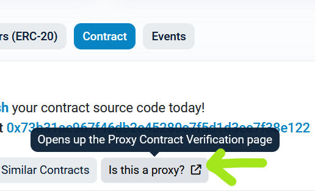

# Verification

The automatic verification process in Foundry, initiated by the --verify flag during deployment, appears to be non-functional. This issue is likely attributed to a Foundry error. Nonetheless, verifying contracts manually using command-line and Etherscan website remains a relatively straightforward process.

**Counter**

Verifying Counter seems to be more or less automatic.

Verifying Counter:
```
forge verify-contract COUNTER_ADDRESS Counter --watch --chain sepolia
```
Verifying AmbrosiaV2:

```shell
source .env && forge verify-contract AMBROSIAV2_ADDRESS AmbrosiaV2 --watch --chain DESIRED_CHAIN

```

*Note: You can obtain `COUNTER_ADDRESS` from deployment logs, it is "Counter address".*

On Mumbai it requires more effort to verify the contract. Run:
```
forge verify-contract COUNTER_ADDRESS Counter --chain mumbai --show-standard-json-input > etherscan.json
```

Sometimes even manually uploading the file doesn't seem to work for Mumbai network.

And then manually upload that JSON file as Standard Input into Mumbai Polygonscan. Automatic verification is broken, error:
```
Encountered an error verifying this contract:
Response: `NOTOK`
Details: `Invalid API Key`
```

**Proxy**

Verifying UUPSProxy seems to require marking the contract as proxy in Etherscan interface by clicking "Is this proxy?"



Full verification can be done by manually obtaining constructor args and executing following command:
```
source .env && forge verify-contract PROXY_ADDRESS_HERE UUPSProxy --constructor-args $(cast abi-encode "constructor(address,bytes)" 0xAfBDd7381877413a3f66574Fd791b3C9b68624b8 0x8f15b414000000000000000000000000000000000000000000000000000000000000008000000000000000000000000000000000000000000000000000000000000000c00000000000000000000000001a44076050125825900e736c501f859c50fe728c00000000000000000000000093399683ece60a442956e75e6c2a68dd95d3b34c0000000000000000000000000000000000000000000000000000000000000008416d62726f7369610000000000000000000000000000000000000000000000000000000000000000000000000000000000000000000000000000000000000004414d425200000000000000000000000000000000000000000000000000000000) --watch --chain mainnet
```
For Base and Arbitrum you have to specify the API Key in the command:

```shell
source .env && forge verify-contract PROXY_ADDRESS_HERE UUPSProxy --constructor-args $(cast abi-encode "constructor(address,bytes)" 0xAfBDd7381877413a3f66574Fd791b3C9b68624b8 0x8f15b414000000000000000000000000000000000000000000000000000000000000008000000000000000000000000000000000000000000000000000000000000000c00000000000000000000000001a44076050125825900e736c501f859c50fe728c00000000000000000000000093399683ece60a442956e75e6c2a68dd95d3b34c0000000000000000000000000000000000000000000000000000000000000008416d62726f7369610000000000000000000000000000000000000000000000000000000000000000000000000000000000000000000000000000000000000004414d425200000000000000000000000000000000000000000000000000000000) --watch --chain arbitrum --etherscan-api-key $ARBISCAN_KEY
```


Constructor arguments can be obtained from `./broadcast/multi/AmbrosiaV2.s.sol-latest/deployAmbrosiaV2Mainnet.json` after running deployment script. Last 384 characters prefixed by 0x of transaction data from `UUPSProxy` deployment.